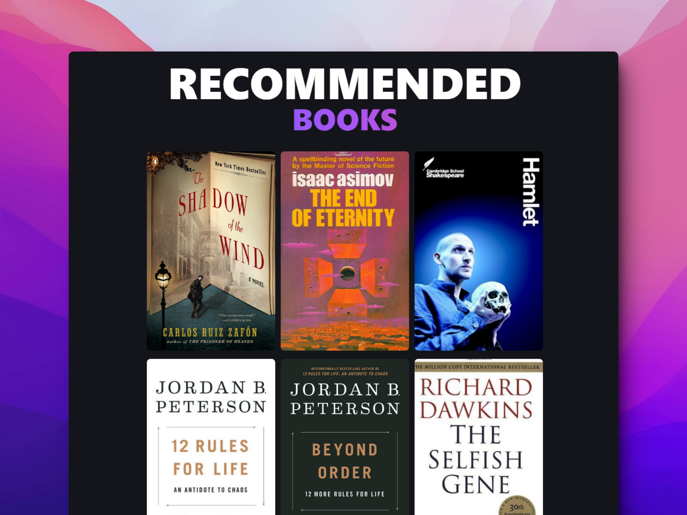

  
# 📚 Astro: Abraham Books

### Lista de mis libros favoritos

> 🧩 Aquí puedes ver su [**Live Demo**](https://abraham-books.netlify.app/)

## 🚀 Descripción

Es una lista de mis libros favoritos utilizando Astro como librería y Tailwind.

Como punto a destacar implementaba las [View Transitions API](https://developer.chrome.com/docs/web-platform/view-transitions/) de forma vanilla implementada por Chrome. Antes de que fuera actualizado a la version de [Astro 3.0](https://astro.build/blog/astro-3/)

## 🎭 Tecnologías

El proyecto utiliza las siguientes tecnologías:

- **Astro** como framework.
- Página 404, para direcciones incorrectas.
- [**Rutas dinámicas**](https://docs.astro.build/en/core-concepts/routing/#dynamic-routes) para crear páginas únicas para cada libro.
- Las [**ViewTransitions**](https://docs.astro.build/en/guides/view-transitions/) de Astro para crear animaciones entre páginas.
- [**Tailwind CSS**](https://tailwindcss.com/) para aplicar los estilos.
